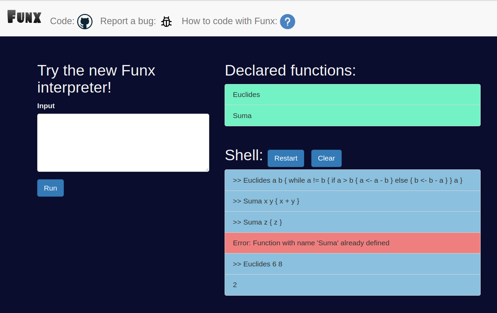
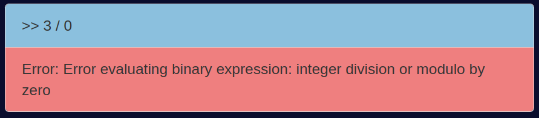

     ________ ___  ___  ________      ___    ___
    |\  _____\\  \|\  \|\   ___  \   |\  \  /  /|    
    \ \  \__/\ \  \\\  \ \  \\ \  \  \ \  \/  / /
     \ \   __\\ \  \\\  \ \  \\ \  \  \ \    / /    
      \ \  \_| \ \  \\\  \ \  \\ \  \  /     \/     
       \ \__\   \ \_______\ \__\\ \__\/  /\   \     
        \|__|    \|_______|\|__| \|__/__/ /\ __\
                                     |__|/ \|__|    By Gonzalo Córdova
# Interpreter

This is the project corresponding to the GEI-LP task (edition 2022-2023 Q1) at the Polytechnic University of Catalonia. Our task was to implement an interpreter for a programming language based on expressions and functions. The input and output of this interpreter will be through a web interface, although a command line interface is also provided. The description of the task (Funx spec) can be found [here](https://github.com/gebakx/lp-funcions).

# Contents

- [Project structure](#project-structure)
- [Quick start](#quick-start)
- [Grammar](#grammar)
     - [Extensions](#extensions)
          - [Boolean values](#boolean-values)
          - [Logical operators](#logical-operators)
          - [Modulo operator](#modulo-operator)
          - [Comments](#comments)
- [Interpreter](#interpreter)
     - [Binary operators evaluation](#binary-operators-evaluation)
     - [Error handling](#error-handling)
- [Web page](#web-page)
     - [Navigation bar](#navigation-bar)
     - [Home page (interpreter)](#home-page-interpreter)
- [Tests](#tests)

# Project structure

This are the files of the project:

- [funx.g4](./funx.g4): Grammar of the language.
- [funx.py](./funx.py): Web Interpreter.
     - `main()`, `report()`: Main view functions of the web page. They are used to render the main and report pages.
     - `run_funx` function: Function to run the interpreter.
- [cli.py](./cli.py): Command line Interpreter.
- [app](./app) directory: Web page.
     - [templates](./app/templates) directory: Templates of the web page.
          - [base.html](./app/templates/base.html): Base template of the web page.
          - [navbar.html](./app/templates/navbar.html): Navigation bar template.
          - [main.html](./app/templates/main.html): Main template of the web page.
          - [report.html](./app/templates/report.html): Report template of the web page.
     - [static](./app/static) directory: Static files of the web page (css, js, images).
     - [init](./app/__init__.py): Initialization file of the web page.
     - [forms.py](./app/forms.py): Forms of the web page.
- [test-basic.funx](./test-basic.funx) Test script 1
- [test-new.funx](./test-new.funx) Test script 2
- [README.md](./README.md): This file.
- [requirements.txt](./requirements.txt): Python dependencies.
- [.gitignore](./.gitignore): Files to ignore in the git repository.


# Quick start

Make sure you have Python 3.8 or higher installed. You can download it [here](https://www.python.org/downloads/).

Install the dependencies in your virtual environment with the following command:

```{bash}
pip install -r requirements.txt
```

Before running the interpreter, the ANTLR4 command to generate the parser and lexer must be executed:

```{bash}
antlr4 -Dlanguage=Python3 -no-listener -visitor funx.g4
```

- The file [funx.py](./funx.py) runs the interpreter in the web page. 
- The file [cli.py](./cli.py) runs the interpreter in the command line.

You can run the interpreter in the web page by running the command:

```{bash}
set FLASK_APP=funx.py
flask run
```



You can run the interpreter in the command line by running the command:

```{bash}
python cli.py
```

# Grammar

The main grammar description is in the task description that can be found [here](https://github.com/gebakx/lp-funcions).

The grammar of the language is defined in the file [funx.g4](./funx.g4). This file is used to generate the parser and lexer of the language. These files are generated by the ANTLR tool. The ANTLR tool can be downloaded [here](https://www.antlr.org/download.html).

### Extensions

The grammar of the language has been extended with the following features:

#### Boolean values
___

The language has been extended with the boolean values `true` and `false`. For example we can define the function `Not`:

```
>>> Not x { if x { false } else { true } }
>>> Not true
0
```

This is just syntactic sugar, true and false are interpreted as 1 and 0 respectively (task requirement). That is way the output of the previous example is returned as 0 instead of false.

#### Logical operators
___


The language has been extended with the logical operators `and`, `or` and `not`. These operators are used to evaluate logical expressions.

- `and` or `&`
- `or` or `|`
- `not` or `!`

For example we can define the function `Isinrange` to check if a number is in a range:

```
>>> Isinrange x y z { x >= y & x <= z }
>>> Isinrange 5 1 10
1
```

#### Modulo operator
___

The language has been extended with the modulo operator `%`. This operator is used to evaluate the remainder of the division of two integers and can be very useful in some cases.

For example we can define the function `Modexp` to calculate the modular exponentiation (given n, k and m, computes n^k mod m):

```
>>>  Modexp n k m {
          if k = 0 { 1 } else {
               if k % 2 = 0 {
                   ((Modexp n (k/2) m)^2)%m 
               } else {
                   ((((Modexp n (k/2)  m)^2)%m)*n)%m
               }
          }
     }
>>> Modexp 2 10 10000
1024
>>> Modexp 2 10 2
0
```

#### Comments

**Line comments**

The language has been extended with the line comments. This comments are defined with the `#` symbol and are ignored by the parser.

```
>>> # This is a comment
>>> 1 + 1 # This is a comment
2
```

**Block comments**

The language has been extended with the block comments. This comments are defined with the `/*` and `*/` symbols and are ignored by the parser.

```
>>> /* We can write
     a block comment
     */
>>> 1 + /* This is a comment */ 1
2
```

#### Operators precedence
___

This is not an extension, but it is worth mentioning that the operators precedence is defined in the grammar. The precedence is defined is the same way as in Python. In this table we can see the precedence of the operators:

| Operator | Description | Precedence |
|----------|-------------|------------|
| () | Parentheses | 1 |
| - | Unary minus | 2 |
| ^ | Exponentiation | 3 |
| * / % | Multiplication, division and modulo | 4 |
| + - | Addition and subtraction | 5 |
| < > <= >= = != | Comparison operators | 6 |
| not | Logical negation | 7 |
| and | Logical conjunction | 8 |
| or | Logical disjunction | 9 |

This is the grammar defined in the file [funx.g4](./funx.g4) that generated a visitor function for each of the operators categories. How the visitors are defined is explained in the [Interpreter](#interpreter) section.

`operationExpr` visitor function is the generic visitor function that will be used in the interpreter to evaluate the operators. More information about this function is explained in the [Interpreter](#interpreter) section.

```{g4}
expr : '(' expr ')'                                    # parenthesizedExpr
    | ID_FUNCTION expr*                                # functionCall
    | <assoc=right> expr '^' expr                      # operationExpr
    | '-' expr                                         # negativeExpr
    | expr ('*' | '/' | '%') expr                      # operationExpr
    | expr ('+' | '-')  expr                           # operationExpr
    | expr ('<' | '>' | '<=' | '>=' | '=' | '!=') expr # operationExpr
    | ('not' | '!') expr                               # operationExpr
    | expr ('and' | '&') expr                          # operationExpr
    | expr ('or' | '|') expr                           # operationExpr
    | BOOL                                             # boolExpr
    | NUM                                              # numExpr
    | ID                                               # varExpr
    ;
```

# Interpreter

The main component of the interpreter is the Visitor class in the [visitor.py](./visitor.py) file. This class is used to visit the parse tree generated by the parser. The visitor is used to evaluate the expressions of the language and to give the result of the evaluation.

```{python}
class Visitor(ParseTreeVisitor):
    """
    A visitor for the parse tree produced by funxParser.

    Attributes
    ----------
    variables : list
        Stack of dictionaries. Each dictionary represents a scope.
    func_dict : dict
        Dictionary of functions. Each function is a tuple of two elements:
        a list of parameters and a block of instructions.
    operations : dict
        Dictionary of operations. Each operation is a function that takes
        two arguments and returns a value.

    Methods
    -------
    reset()
        Reset the visitor. Clear the stack of dictionaries and the function
        dictionary.
    visitRoot(ctx)
        Visit the root of the parse tree and return the result of the
        evaluation.
    visitOperation(ctx)
        Generic method to visit an operation. The operation is determined
        by the context (length of the children and symbol).
    All the other methods are self-explanatory.
    """
```

Some particular aspects of this interpreter that could differ from other interpreters are:

#### Operators evaluation
___

The evaluation of the operators is implemented with a generic visitor function `visitOperationExpr` that is used to evaluate all the operators. 

The presence of lambda functions in Python, allows the evaluation of operators to be done in a simple way. The visitor has a dictionary with the operators and their corresponding lambda function. The visitor uses this dictionary to evaluate the binary operators.

Dictionary of operators:

```{python}
self.operations = {
     "+": lambda a, b: a + b,
     "-": lambda a, b: a - b,
     "*": lambda a, b: a * b,
     ...
}
```

As we can see, depending on the operator, the lambda function takes one or two arguments. The visitor function `visitOperationExpr` is used to evaluate operators. It takes into account the number of arguments that the operator takes and calls the corresponding lambda function according to the symbol of the operator.

```{python}
def visitOperationExpr(self, ctx: funxParser.OperationExprContext):
     children = list(ctx.getChildren())
     if len(children) == 3:
          a = self.visit(children[0])
          b = self.visit(children[2])
          symbol = children[1].getText()
          return int(self.operations[symbol](a, b))
     elif len(children) == 2:
          a = self.visit(children[1])
          symbol = children[0].getText()
          return int(self.operations[symbol](a))
```

The `int()` function is used to convert the result of the lambda function to an integer. This is necessary because relational should return an integer value (0 or 1) according to the task specification.

Note: The `visitNegativeExpr` function is used to evaluate the unary operator `-`. It is done in order to differentiate the unary operator from the binary operator `-`. Here is an example of the difference between the two operators:

```
>>> 4-8 # Binary operator
-4
>>> -4*8 # Unary operator
-32
```

#### Error handling
___

A class has been created to handle the errors that may occur during the execution of the interpreter. This class is called VisitorError and is defined in the [VisitorError.py](./visitor.py) file. This is the implementation of the class:

```{python}
class VisitorError():
    def __init__(self, msg):
        self.msg = msg
```

The class has a single attribute, `msg`, which is the error message. To avoid raising Python exceptions and to propagate an informative message, the visitor will return an instance of the VisitorError class when an error occurs. The interpreter will check if the result of the visit is an instance of the VisitorError class and, if so, it will print the error message.

```{python}
ret = visitor.visit(tree)
if ret is not None:
     if isinstance(ret, VisitorError):
          print(ret.msg)
     else:
          print(ret)
```

Python errors are also used by capturing them with the `try` and `except` statements. For example, when evaluating a division by zero, the interpreter will catch the error and return an instance of the VisitorError class including the error message.

```{python}
except Exception as e:
            return VisitorError("Error evaluating binary expression: " + str(e))
```

With this implementation, all the Python errors that may occur during the binary operator evaluation are handled. We see that this allows the web page to show the error message in a user-friendly way:



These are the main errors taken into account in the interpreter:

- **visitDeclareFunction**:
     - Function name already exists.
     - Parameter names are repeated.
- **visitBinaryExpr**:
     - All the Python errors that may occur during the binary operator evaluation. For example:
          - Division by zero.
          - Type error.
- **visitFunctionCall**:
     - Function name does not exist.
     - Number of arguments is different from the number of parameters.


# Web page

The web page is implemented with Flask. These are the main components of the web page:

#### Navigation bar
___

The navigation bar is implemented with the [Bootstrap](https://getbootstrap.com/) framework. It has four buttons:

- **Funx**: It redirects to the home page.
- **Code**: It redirects to GitHub repository. (not public yet)
- **Report a bug**: It redirects to page to report a bug.
- **How to code with Funx**: It redirects to the [task description page](https://github.com/gebakx/lp-funcions)

#### Home page (interpreter)
___

The home page is the interpreter. The user can write the code in the text area and execute it by clicking the `Run` button.

The results of the execution are shown in the `Output` text area.

Some cool features of the interpreter are:

- **Coloring**: Depending on what is displayed in the `Output` text area, the text will be colored in a different way:
     - *Blue*: Users input code.
     - *Red*: Error messages.
     - *Grey*: Results of the execution.
- **Clear button**: The `Clear` button clears the input and output history.
- **Reset button**: The `Reset` button resets the interpreter. This means that the interpreter will be in the same state as when the web page is loaded (no functions defined, no variables defined, etc.). This is useful to start a new session. When clicked, the `Reset` button will show a confirmation dialog to avoid accidental resets.
- **Declared functions**: The declared functions are shown in the `Declared functions` text area. This is useful to know what functions are defined in the current session.

# Tests

Two `.funx` files have been created to test the interpreter. These files are:
- [test-basic.funx](./test-basic.funx): It contains basic tests included in the task description.
- [test-new.funx](./test-new.funx): It contains new tests that are not included in the task description to test new features.

The scripts include two sections:
- **Function definitions**
- **Test execution**: It contains expressions to test the functions with the expected result in a comment.

**Note**: *All the function calls in the test execution section should not be executed at the same time. This is because the interpret takes only one expression at a time as root of the tree. (task requirement)*
