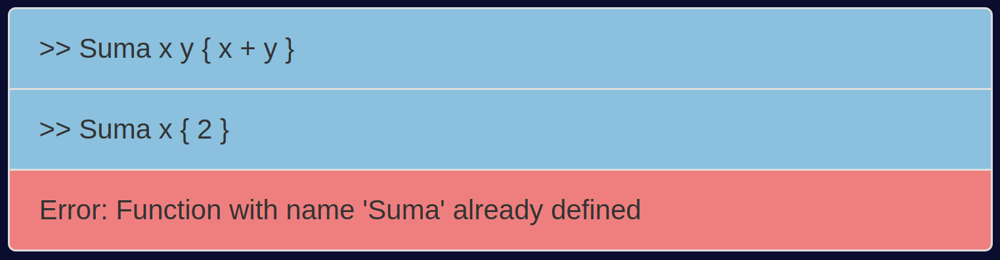

     ________ ___  ___  ________      ___    ___
    |\  _____\\  \|\  \|\   ___  \   |\  \  /  /|    
    \ \  \__/\ \  \\\  \ \  \\ \  \  \ \  \/  / /
     \ \   __\\ \  \\\  \ \  \\ \  \  \ \    / /    
      \ \  \_| \ \  \\\  \ \  \\ \  \  /     \/     
       \ \__\   \ \_______\ \__\\ \__\/  /\   \     
        \|__|    \|_______|\|__| \|__/__/ /\ __\
                                     |__|/ \|__|    By Gonzalo Córdova
# Interpreter

This page describes the GEI-LP task (edition 2022-2023 Q1). Our task was to implement an interpreter for a programming language based on expressions and functions. The input and output of this interpreter will be through a web page, although a command line interface is also provided. The description of the task (Funx spec) can be found [here](https://github.com/gebakx/lp-funcions).

# Quick start

Make sure you have Python 3.8 or higher installed. You can download it [here](https://www.python.org/downloads/).

Install the dependencies in your virtual environment with the following command:

```{bash}
pip install -r requirements.txt
```

- The file [funx.py](./funx.py) runs the interpreter in the web page. 
- The file [test.py](./test.py) runs the interpreter in the command line.

You can run the interpreter in the web page by running the command:

```{bash}
# Run flask app
set FLASK_APP=main.py
set FLASK_DEBUG=1
set FLASK_ENV=development
flask run
```


You can run the interpreter in the command line by running the command:

```{bash}
python test.py
```

# Grammar

The grammar of the language is defined in the file [Expr.g](./Expr.g). This file is used to generate the parser and lexer of the language. The parser is generated with the following command:
     
```{bash}
antlr4 -Dlanguage=Python3 -no-listener -visitor Expr.g
```

The generated files are [ExprLexer.py](./ExprLexer.py) and [ExprParser.py](./ExprParser.py) which are used by the interpreter.

### Grammar extensions

The grammar of the language has been extended with the following features:

___

**Logical operators**

The language has been extended with the logical operators `and`, `or` and `not`. These operators are used to evaluate logical expressions.

- `and` or `&&`
- `or` or `||`
- `not` or `!`

```{python}
# example
a = 1
b = 2
c = 3
d = 4
if a < b and c < d:
     print("a < b and c < d")
```
___

**Modulo operator**

The language has been extended with the modulo operator `%`. This operator is used to evaluate the remainder of the division of two integers.

```{python}
# example
a = 5
b = 2
print(a % b)
# Output: 1
```
___

# Interpreter

The main component of the interpreter is the Visitor class in the [TreeVisitor.py](./TreeVisitor.py) file. This class is used to visit the parse tree generated by the parser. The visitor is used to evaluate the expressions of the language.

Some important aspects of the visitor are:

___

**Binary operators evaluation**

*Note: The binary operators could not be visited in a single function because, to avoid ambiguity, the grammar of the language has been defined in a way that the binary operators are visited in a different function for each category of operators classified by their precedence.*

The presence of lambda functions in Python, allows the evaluation of binary operators to be done in a simple way.The visitor has a dictionary with the binary operators and their corresponding lambda function. The visitor uses this dictionary to evaluate the binary operators.

Dictionary of binary operators:

```{python}
self.operations = {
     "+": lambda a, b: a + b,
     "-": lambda a, b: a - b,
     "*": lambda a, b: a * b,
     ...
}
```

Evaluation of binary operators:

```{python}
def visitBinaryExpr(self, ctx):
     l = list(ctx.getChildren())
     if len(l) == 3:
          a = self.visit(l[0])
          b = self.visit(l[2])
          symbol = l[1].getText()
          return int(self.operations[symbol](a, b))
     raise Exception("Error evaluating binary expression!")
```

The `int()` function is used to convert the result of the lambda function to an integer. This is necessary because relational should return an integer value (0 or 1).
___

**Error handling**

A class has been created to handle the errors that may occur during the execution of the interpreter. This class is called VisitorError and is defined in the [VisitorError.py](./VisitorError.py) file. This is the implementation of the class:

```{python}
class VisitorError():
    def __init__(self, msg):
        self.msg = msg
```

The class has a single attribute, `msg`, which is the error message. To avoid raising Python exceptions and to propagate an informative message, the visitor will return an instance of the VisitorError class when an error occurs. The interpreter will check if the result of the visit is an instance of the VisitorError class and, if so, it will print the error message.

```{python}
ret = visitor.visit(tree)
if ret is not None:
     if isinstance(ret, VisitorError):
          print(ret.msg)
     else:
          print(ret)
```

Python errors are also used by capturing them with the `try` and `except` statements. For example, when evaluating a division by zero, the interpreter will catch the error and return an instance of the VisitorError class.

```{python}
except Exception as e:
            return VisitorError("Error evaluating binary expression: " + str(e))
```

With this implementation, all the Python errors that may occur during the binary operator evaluation are handled:


This allows also to the web page to show the error message in this way:



These are all the errors taken into account in the interpreter:

- **visitDeclareFunction**:
     - Function name already exists.
     - Parameter names are repeated.
- **visitBinaryExpr**:
     - All the Python errors that may occur during the binary operator evaluation. For example:
          - Division by zero.
          - Type error.
- **visitVariableExpr**:
     - Variable name does not exist.
- **visitFunctionCall**:
     - Function name does not exist.
     - Number of arguments is different from the number of parameters.


# Web page

The web page is implemented with Flask. These are the different pages of the web page:

___

**Home page (interpreter)**

The home page is the interpreter. The user can write the code in the text area and execute it by clicking the `Run` button.

The results of the execution are shown in the `Output` text area.

The button `Clear` clears the previous code and output.

The button `Reset` clears the previous code and output and resets the functions.

